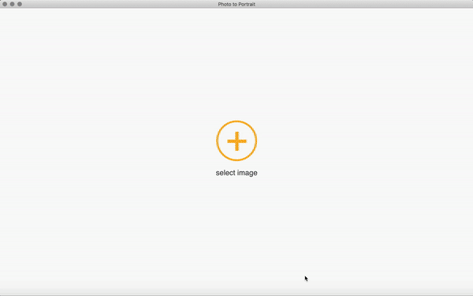

## Photo to Portrait

This app is used to stylize one image like another

### Installation

For neural network:
1. Python 2.7
2. numpy
3. tensorflow => 2.0
4. tensorflow_hub => 0.6.0
5. Pillow

For UI-app
1. Node JS

After all the components installed, open project root directory (where package.json file is located) in terminal and run 'npm install'. When done, run 'npm start'

### Restrictions

* Images can be only png or jpeg (jpg)
* Output image size can't be more than 512px. It can be changed in python-script though.